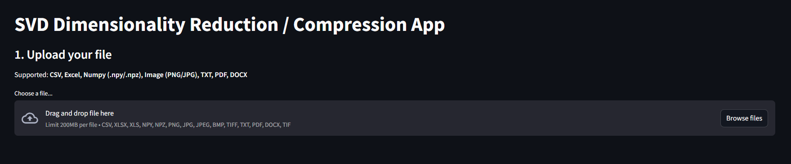
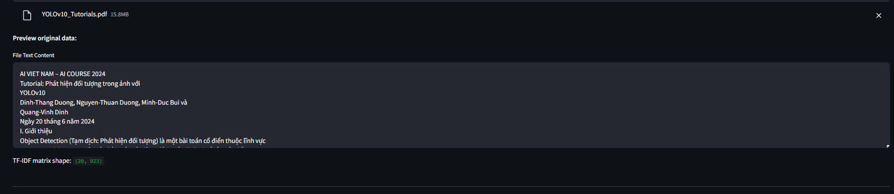
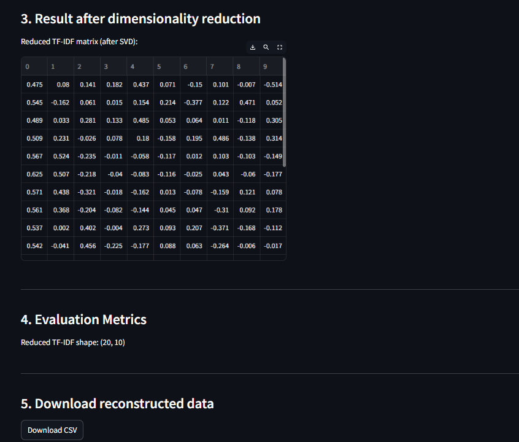

# SVD Dimensionality Reduction & Compression Application

A Streamlit web application for **dimensionality reduction and compression using SVD** (Singular Value Decomposition) and **TruncatedSVD**.
Supports common file types: **CSV, Numpy, Image (PNG/JPG), TXT, PDF, DOCX**.

---



## 📂 Supported File Types

- **CSV**: Numeric data, e.g. datasets from experiments, sensors, etc.
- **Numpy Array**: .npy, .npz files
- **Image**: PNG, JPG, JPEG, BMP, TIFF (converted to grayscale)
- **Text**: .txt, .pdf, .docx (converted to TF-IDF matrix for SVD)

## ✨ Features

- **Upload and preview** your data file (CSV, Excel, Numpy, image, or text).
- **Automatic file type detection** and conversion to numerical matrix.
- **SVD for dense data** (images, numeric tables) and **TruncatedSVD for text** (PDF, TXT, DOCX).
- **Interactive slider** to choose the number of components to keep.
- **Visualization of singular values** to understand variance explained.
- **Instant preview** of the reduced/reconstructed data or image.
- **Error metrics**: RMSE, compression ratio.
- **Download** reconstructed data as CSV or image.

  

  

---

## 🚀 How to Run

Make sure you already have **Streamlit** in your environment to run this application. If not, please download it. Detail of requirement library need to use this application in **requirement.txt**

1. **Clone this repository**

```
Open Gitbash if you downloaded already
cd Desktop
git clone https://github.com/Zackerville/Applied-SVD-for-Dimensionality-Reduction.git
```

2. **Install dependencies**

   ```
   pip install -r requirements.txt
   ```
3. **Run the app**

   ```
   streamlit run app.py
   ```
